# **BATCH COFFEE**
## Milestone Project 4: Full Stack Frameworks with Django - Code Institute
## By Fay Skerritt

Batch Coffee is an online coffee retailer offering single origin coffee from all over the world. Batch Coffee comes in four different grind categories and three different varieties to cater for all coffee lovers.

To test the site you will need the below test credit card numbers from the [Stripe Docs](https://stripe.com/docs/testing): 

Number: 4242 4242 4242 4242
Exp. Date: Anything (e.g. 02/24)
CVC: Anything (e.g. 007)

Visit the deployed site: puffins

# Deployed Site
View the deployed site here - [Batch Coffee](https://pad-plants.herokuapp.com/)


# UX
## Project Goals
The main goal of this project was to create a fully functional web store that sells single origin coffee to coffee lovers.
The web store must allow users to browse products, save any they like the look of, purchase them using a credit card and review their personal information including past order summaries.

## User Stories
### Viewing, Sorting and Searching

* As a shopper, I want to view all products so I can see what is available to purchase on the site
* As a shopper, I want to view details about a specific product so I can see the price, details and description of the product
* As a shopper, I want to view products in categories so I can see the range of products available
* As a shopper, I want to sort products by category so I can view the specific category I am interested in 
* As a shopper, I want to sort products by price so I can find the best prices
* As a shopper, I want to sort products by more than one category at the same time so I can view the prices of the categories I am interested in 
* As a shopper, I want to search for product by name or description so I can find a specific product I would like to purchase
* As a shopper, I want to see the search terms I used and how many results my search got so I can see whether the product I am interested in is available

### User Admin
* As a site user, I want to register for an account so I can be able to view my personal account
* As a site user, I want to login and logout of my account so I can access my account and information
* As a site user, I want to recover my password if I forget it so I can get back into my account if I have forgotten my password
* As a site user, I want to receive an email confirmation after registering so I can verify that my account registration was successful
* As a site user, I want to have access to a personalised user profile so I can view my order history, order confirmations and save my delivery and payment information

### Buying
* As a shopper, I want to choose the quantity of a product when purchasing so I can add more than one item to my bag at a time
* As a shopper, I want to choose the size of a product when purchasing so I can add the correct size to my bag
* As a shopper, I want to view all items in my bag that I have added so I can see the total cost of the items I will receive
* As a shopper, I want to change the quantity of products in my bag so I can make changes to my bag before checkout
* As a shopper, I want to enter my personal details and payment details so I can quickly and easily checkout
* As a shopper, I want to feel that my personal information is secure so I can provide the required information confidently
* As a shopper, I want to see my order details confirming my order has been placed so I can make sure all information is correct
* As a shopper, I want to receive an order confirmation email once my order has been placed so I can keep the confirmation email for my records

### Store Admin
* As a store owner, I want to add a product so I can add new items to my online store
* As a store owner, I want to edit or update a product so I can change the price or details of any product to keep them up to date
* As a store owner, I want to delete a product so I can remove items from my online store I no longer sell

## Design
### **Colour Scheme**
* Dark green was chosen as a secondary colour as it is a natural colour that compliments white text on top of it.
* Below is a branding Cascading_Style_Sheets

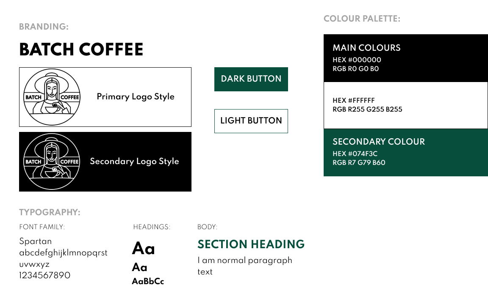

### **Typography**
* Spartan was chosen for the font on the site with a lot of uppercase text which looks nice and linear.

### **Imagery**
* The home page features two artistic images of coffee, which capture the eye and go well with the coffee theme.
* Font Awesome icons are used in areas to clearly label input fields, sections and headers.
* Each item has a item image which was created by myself adding Batch Coffee branding to an empty bag.

### **Wireframes**
**Laptop:**

* The laptop wireframes are very similar to the displayed site with container used to leave spaces near the outer edges of the screen on larger screens. 
* The only real difference is the profile page which I incorporated a side menu into to navigate the three account pages.
* 
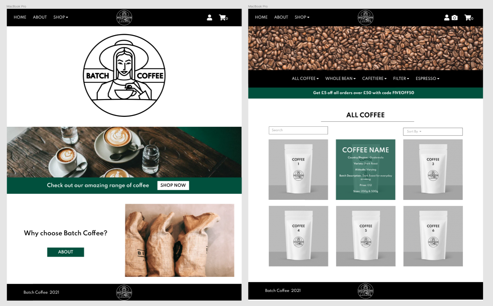
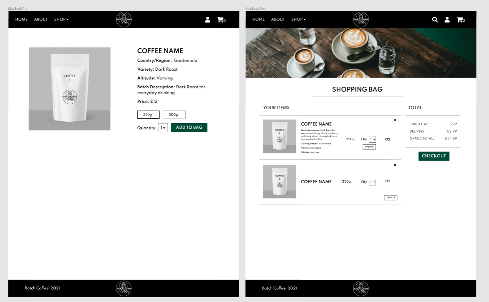
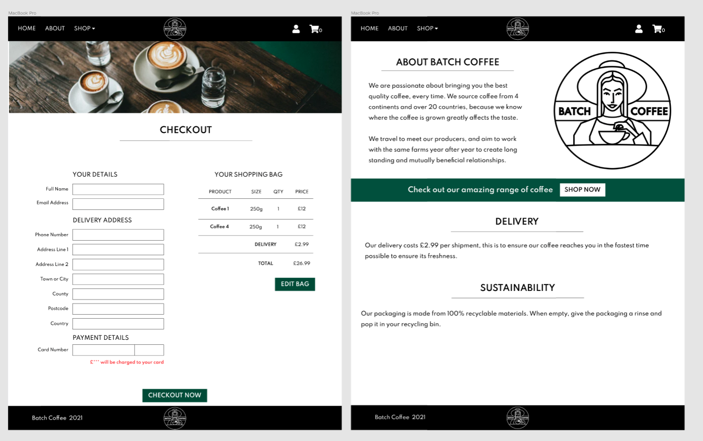
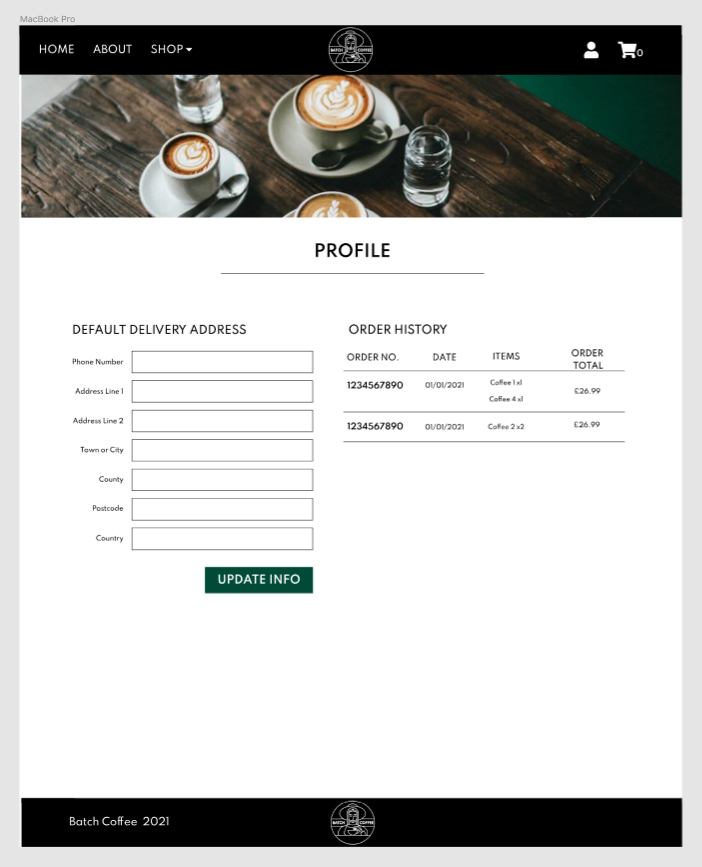

**Ipad:**

* Certain pages went from two columns to one on the smaller screen to ensure everything is easily visible.
* It was decided against using imagery on all pages as the images became very large to still look good on wide screens.
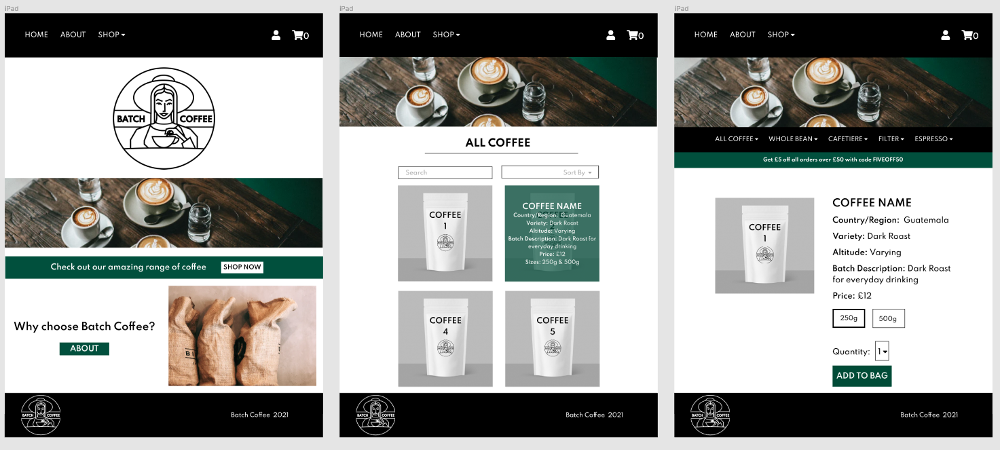
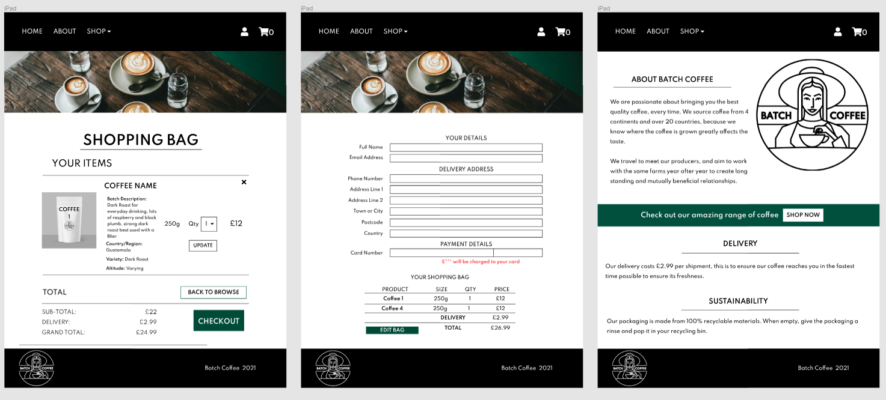
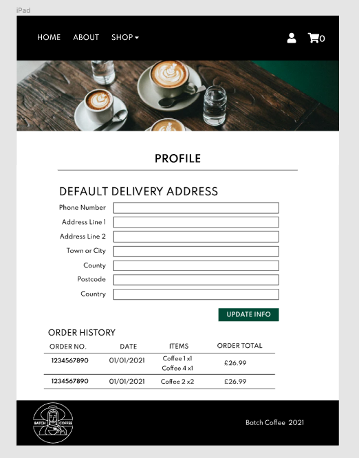

**Mobile:**

* Almost everything on mobile is 1 column minus the item card in the bag.
* The navbar and footer differ slightly in the deployed site to the wireframes due to ensuring it was responsive across all screen sizes.
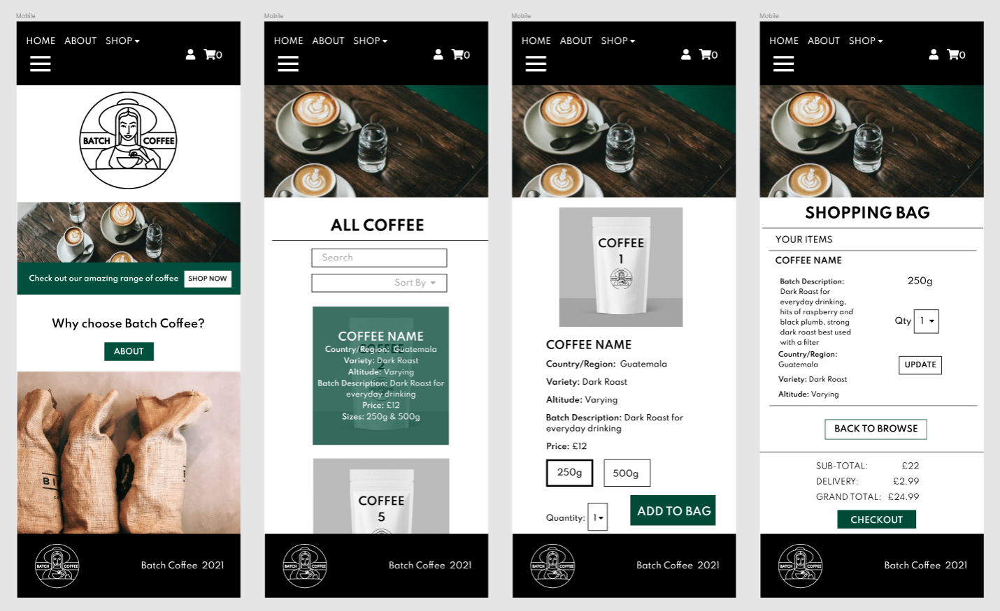
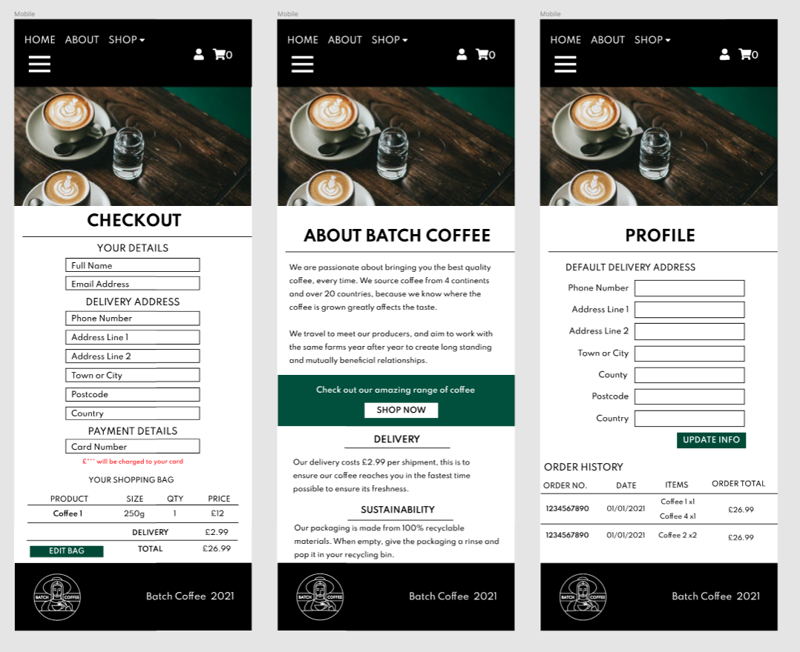


### Database Structure
During the development of Batch Coffee the built-in SQLite3 database was used. Once deployed to Heroku the database was transferred over to a postgressql database which is used in the deployed site.
User authentication and permissions were managed by Django's authentication system as well as [Allauth](https://django-allauth.readthedocs.io/en/latest/overview.html) from Django which was installed.

The database below shows the links between all the tables 

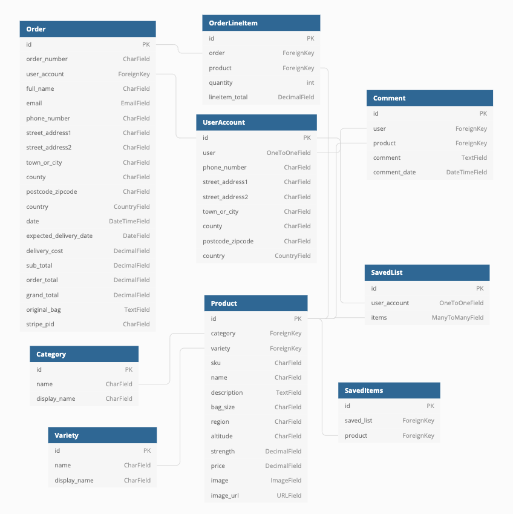

# Features
### Existing Features
#### Navbar
* Shop dropdown offers range of sortation methods to sort coffee
* Searchbar displayed in navbar for ease of use. Collapses down into an icon on mobile where the search box drops down when clicked.
* Fixed to top of screen for good accessibility
* Bag icon with number of items rendered next to it to show how many items in the shopping Bag
* Heart icon which takes user to their saved items

#### Home Page
* Big logo to show branding
* Use of images that help to explain what the site sells
Buttons that take the user straight to browse products or to the about page

#### Footer
* Fixed to bottom so never floating in the middle of the screens
* Links to social media

#### About Page
* Explanation of what Batch Coffee sell
* Extra information about products and service provided

#### Shop
* Sort bar to sort all products by Price, Strength, Grind Category and Name - both ascending and descending
* Breadcrumb to show what products you are currently viewing and if you are viewing all the Varieties as buttons to allow the user to view only one
* Display of how many items are being shown on screens
* List of products with basic info in card body, on hover the rest of the product info slides over image with description
* Each product has it's Category as a link so user can see all of that category if they wish
* Each product has a heart icon which allows the user to add it to their saved items list

#### Product Page
* Product displayed showing all relevant information with a nice sized image
* Breadcrumb also on product page to show the product name
* Quantity drop down for user to choose qty if they wish to purchase
* Button to add product to bag which will take the quantity selected
* Another button with a link back to shop
* Save icon on product page also for user to add to their saved items
* Comments section at the bottom of each product page for users who are signed in to leave a comment about the product
* Users are able to delete their own comments

#### Shopping bag
* Table format shopping bag clearly labelled
* Quantity selector allows user to adjust quantity of items in Bag
* When quantity selector is changed javascript shows two buttons, one to submit the update of quantity or the other to cancel, revert the quantity back to the original quantity and hide the buttons using javascript again
* Table showing current totals of shopping bag with sub-total, discount if user has spent over threshold, delivery and grand total.
* Discount with message is shown if bag sub-total is above discount threshold
* Message telling user how much more they need to spend to get the discount if the sub-total is below threshold
* One button to take user back to shop and one to proceed to checkout

#### Checkout
* Summary of items in bag
* Form with placeholders to show personal details, delivery information and payment information needed from user
* Autofill of user details if they have them saved in their account
* Checkbox to give users who are logged in the otion to save their details to their account
* Stripe payment input that responds quickly to invalid card details
* Button to submit form labelled Pay Now
* Confirmed amount that will be charged to card just above pay button
* Button to go back to bag if user has changed their mind

#### Successful Checkout
* Message to let user know they have been sent an order confirmation to their email address
* Summary of their order details including the address it is being sent to and the estimated delivery date
* Sum of total number of items on the order with brief grid of items
* Side menu that gives user other account related options or to go back to shop

#### Login and Regsiter pages
* Users can register for an account, they will need an email which will require an email confirmation, a username and a password that they will need to confirm to ensure they match
* Password reset available if needed

#### My Account
* User can view their saved delivery details and update them if required
* User can view order history with the status of the order 
* User can view their saved items which they can then choose to remove from saved list by clicking the heart icon again

#### Store Admin
* Site owners are able to add products using a form with a dropdown for category and variety, seletors for strength and price and an image field
* Site owners are able to edit any product from the product page, during editing the image will be shown as a thumbnail for better visibility
* Site owners are able to delete any product from the product pages
* Site ownsers are able to log in to the django admin and can create, edit and delete products, users, comments, saved lists and items from the database


### Defensive Programming
* Links to user account and saved items hidden if user not logged in, only links to login or register.
* Save icon on products is greyed out if user not logged in and if hovered a tooltip will tell them to login to save and if they do click they will be redirected to the login page
* Messages will display in toasts to notify user of an issue or success of an action.
* Holding text if no items to ensure user knows it is not just an empty space
* Comment form not visible if user is not logged includes
* Loading spinner and overlay are shown once checkout form has been submitted, to ensure no information can be changed or the form resubmitted
* Comment delete button only visible to user who created it
* Edit and delete buttons on the product pages are only visible to superuser when logged includes
* Django decorator used to ensure users who are not superusers are unable to add, edit or delete products from the site


### Features to Implement in the Future
* Pagination on the shop page as the database grows.

# Technologies Used
### Databases
- [Sqlite3](https://www.sqlite.org/index.html)
- [postgresSQL](https://www.postgresql.org/)

### Coding Languages
- [CSS](https://www.w3.org/Style/CSS/)
- [HTML](https://html.spec.whatwg.org/multipage/)
- [Javascript](https://developer.mozilla.org/en-US/docs/Web/JavaScript)
- [Python](https://www.python.org/)

### Frameworks
- [Bootstrap](https://www.bootstrapcdn.com/)
- [Django](https://www.djangoproject.com/)
- [jQuery](https://jquery.com/)
### Libraries and Tools 
- [Figma](https://www.figma.com/)
- [Google Fonts](https://fonts.google.com/)
- [Font Awesome](https://fontawesome.com/)
- [Dj-Database-URL](https://pypi.org/project/dj-database-url/)
- [Django-Countries](https://pypi.org/project/django-countries/)
- [Django-Heroku](https://pypi.org/project/django-heroku/)
- [Django-Storages](https://django-storages.readthedocs.io/en/latest/)
- [Git](https://git-scm.com/)
- [GitHub](https://github.com/)
- [Gitpod](https://www.gitpod.io/)
- [Gunicorn](https://pypi.org/project/gunicorn/)
- [Jigsaw – CSS Validation](https://jigsaw.w3.org/css-validator/)
- [JS Hint](https://jshint.com/)
- [PEP8](http://pep8online.com/)
- [Pillow](https://pillow.readthedocs.io/en/stable/)
- [PIP](https://pip.pypa.io/en/stable/installing/)
- [Psycopg2](https://pypi.org/project/psycopg2/)
- [Stripe](https://stripe.com/gb)
- [W3C – HTML Validation](https://validator.w3.org/)
- [MarkdownTOC](http://ecotrust-canada.github.io/markdown-toc/')

### Hosting
- [Heroku](https://www.heroku.com/)
- [AWS S3 Bucket](https://aws.amazon.com/)


# Testing
### Code Validation
* [HTML Validator](https://validator.w3.org/nu/?doc=https%3A%2F%2Fpad-plants.herokuapp.com%2F) - No errors found
* [CSS Validator](https://jigsaw.w3.org/css-validator/validator) - No errors found 
* [JSHint](https://jshint.com/) - No issues found 
* [PEP8](http://pep8online.com) - No issues found

### Testing User Stories
#### New User
* As a new user, I want to understand the main purpose of the site, so I can learn more about the site’s features.
    * Once loaded, the home page clearly explains the sites purpose and prompts the user to register via a button so that they can "discover the best houseplants for your home and share your favourites with others", when clicked, the register button takes the user to the Registration page.
    * Tested on different browsers and devices and the layout works well on all, collapsing from 2 columns to 1 on smaller devices.
    * The register button was tested on all browsers and devices by either clicking or touching depending on device, the registration form successfully loaded on all.
* As a new user, I want to see the plants featured on the website, so I can learn more about plants.
    * When clicked, the clearly labelled "Plants" tab in the Navbar or the "Browse" button on the homepage takes the user to the plants.html page where all plants in the database are displayed once loaded. This list is displayed in a card grid format and can be scrolled through to view all plants, or alternatively use the search form to search using the different inputs.
    * Tested on different browsers and devices and the grid is responsive depending on screen size, looks good on all and displays all information clearly on all.
* As a new user, I want to be shown where I can buy plants, so I can purchase a house plant.
    * On the home page there is a link to the "plant store", this stands out on a clear green background and when clicked, the link takes the user to an Amazon 'Houseplants' search in a new tab, which in the future will be set up to a Pad Plants store.
    * Tested on different devices and browsers to ensure it always opened in a new tab which it did.

#### Returning User
* As a returning user, I want to register to the site, so I have my own profile to store my information.
    * On the home page, when clicked, the "Register" button takes the user to the registration page, this page displays a form that requires the user to enter a username and password, then to re-enter the password to ensure the user has correctly entered their desired password. The form has 3 required inputs which will flag with an exclamation mark if the entry is not valid. The username is required to be between 5 and 15 characters and the following characters are allowed; A-Z a-z 0-9 ! @ # $ % ^ & * _ = + - this is the same for the password fields.
    * Tested by using different formats of username and password including one with lots of symbols and one with none, some with only numbers and all worked fine.
    * Also tested by leaving some of the inputs blank as well as clicking register without filling anything in. Every time a pop up appeared telling the user to fill in the missing field.
* As a returning user, I want to add plants to the database, so I can share my plant knowledge with the community.
    * Create functionality provides the user with a form to add in details about the plant. 
    * There are three text input fields; "Name" which is required and must be between 3 and 30 characters, "Botanical Name" which is not required and must also be between 3 and 30 characters then "Description" which is required and must be between 5 and 200 characters. 
    * Two drop down select options allow the user to choose the watering schedule and size of plant.
    * Tested by adding plants making sure to test all possible selections and options.
    * Also tested by leaving some required fields blank, this caused a pop up to appear telling the user to fill in the missing field. It was decided when developing that the check boxes would not be required as to not put off users who did not know this information.
* As a returning user, I want to have access to all plants added by other members, so I can benefit from other people's knowledge.
    * All plants are visible to all users on the Plants page, in descending order so a returning user can view most recently added plants.
    * As above, this was tested on different browsers and devices, page is fully responsive to changes in size.
* As a returning user, I want to be able to logout of my profile, so I can keep my data safe.
    * Logout option in the navbar will delete session cookies for that user and take them back to the login page where they will need to re-enter their credentials again to log back in.
    * Tested by logging in and using the logout button with the dev tools open to ensure session cookies was deleted. Successful every time.

#### Frequent User
* As a frequent user, I want to edit my added plants, so I can keep the information current.
    * Every plant that the currently logged in user has added will have an edit button, which will take the user to an edit form which will fill in the form with the current data from the database and will allow the user to edit each input then save, or alternatively cancel if they decide to no longer edit.
    * Tested by changing the inputs multiple times and checking each time after clicking save that the data has been updated on MongoDB, which was successful every time.
    * Also tested by taking the URL of the edit page and logging out then trying to view the URL, this shows an error message telling the user they are not authorised to edit the plant and a cancel button that returns you to the plants page for security reasons.
* As a frequent user, I want to search for specific plants, so I can find information about plants I own.
    * The Plants page includes a search bar which allows the user to search any word and will search within the database from the name, botanical name and description keys.
    * This was tested by searching the database using words that I knew were in the database, these all displayed the correct plants.
    * It was also tested using words that are not present in the database which brought up the no plants found text.
* As a frequent user, I want to be able to delete my added plants, so I can ensure no duplicates in the database.
    * Every plant that the currently logged in user has added will have a delete button, which will remove the plant from the database. If clicked there is a pop up that requires the user to confirm deletion to prevent accidental deleting.
    * To test this 5 test plants were added and 3 were deleted from the plants page and 2 from the profile page. The id in the URL was checked for each and Mongodb was also checked to ensure the data had been deleted. All worked fine.
* As a frequent user, I want to view all plants with specific filters, so I can choose a new house plant to suit my needs.
    * As mentioned above there is a search bar which searches the name, botanical name and description of all plants in the database.
    * There are also two drop down options which allow the user to choose a room and/or a size. Finally there are two checkboxes; one which will display plants that do not require a lot of light and/or the other which will display plants that do not require frequent watering. 
    * Each input can be searched on its own or they can be combined to create an advanced search of the list of plants from the database.
    * This was tested by searching the database with every possibility of search:
        * Individual input search, so tried searching by all 5 rooms on their own, all sizes on their own and each check box checked on its own. Worked fine
        * Two inputs selected, this was trialled with; room & size, room and light, room and water, size and light, size and water, light and water all worked fine and showed correct findings, or none found.
        * Three inputs selected, this was trialled on all rooms with a size selected then each checkbox selected, all worked fine or showed the none found text.
        * All inputs selected; this was trialled with all selected which only showed results for certain rooms, but all were correct.
        * Finally all of the above were tested with a text input as well, all tests worked fine and showed correct list of plants.

#### Site Owner/Developer
* As the owner/developer, I want to expand my database of plants, so I can broaden my knowledge.
    * The site is simple to use, users are directed to the register page from the home page as well as if they search for a plant and there are no results.
    * Logging into the site is easy and when registering you have to confirm your password, so users are less likely to forget their credentials.
    * Adding a plant is also easy, the botanical name is not required so even if users don't have that information, they are still able to add a plant.
    * This was tested by friends and relatives who tested the site for me.
* As the owner/developer, I want to redirect users to a store, so I can gain sales from people interested in plants.
    * The link to a store is clearly visible to all users on the homepage with a clear green background.
    * This was tested by clocking the link and ensuring the page opened in a new tab.
* As the owner/developer, I want to grow my community of plant lovers, so I have an audience of potential customers.
    * The site looks nice and is inviting with nice images and a good layout, which will attract users to explore further as well as make them more likely to return.
    * This was tested by asking family and friends for feedback, which was all very positive.


### Manual Testing
#### Functionality
* All internal links are clearly labelled and work correctly when clicked.
* All external links are clearly labelled, work correctly and open in a new tab.
* All buttons are clearly labelled and work correctly.
* All forms submit data in the correct format for the database and provide the correct options for the user to choose from.
* All inputs, dropdown menus and checkboxes work correctly and submitting these displays the correct results.
* Cookies work correctly when logging in and logging out.
* All photos render clearly and the correct size and position.
* All plant information renders clearly and the correct size and position.

#### Database
* All data inputs to the database follow the same format, whether they are added on the database or through the web app.
* All updated data through the edit plant button updates the database correctly.
* All user information is clearly and securely stored in the database.

#### Interface
* Each page of the web app has the same consistent layout.
* The font, colour scheme and styling is consistent across the web app.
* All queries from the database display the plant data clearly and well formatted across both the plant page and profile page.
* The site link hosted through Heroku displays everything correctly.

#### Security
* Incorrect login details returns a generic error message and reloads the page.
* Users can only update and delete plants that they have added, jinja templating is used to hide information from any users that are not authorised.
* Password confirmation when registering ensures users remember their login credentials.
* Password is hashed so the password that the user inputs when registering is never saved in the database.

#### Accessibility
* All images have an alt attribute which explains the image for screen readers.
* Aria labels are also used when the alt attribute is not available.
* Semantic markup is used for clear html structure.
* Contrast of colours used across the site were checked in Google Dev Tools to ensure the contrast was AA meaning a score between 3.0 and 4.5.

#### Usability
* Styling and JavaScript are used to make the navbar interactive when hovered over to engage the user.
* The active page is bold in the navbar to tell the user which page they are on.
* All links in the navbar work correctly and take you to the correct page.
* The collapsible navbar works correctly on smaller screens with the hamburger button working to show the navbar links.
* If an error occurs with the URL the 404 page explains what has happened and displays a link back to the plants page.
* Flash messages are displayed in a banner near the top of the page which is the same on every page giving the user feedback or confirming an action.

#### Compatibility
* The web app was viewed on the following browsers and worked correctly on all; 
    * Google Chrome
    * Safari
    * Internet Explorer

#### Responsiveness
* The web app was viewed on the following devices and worked correctly on all;
    * MacBook
    * MacBook Pro
    * Dell Laptop
    * Desktop monitor
    * iPad Mini
    * iPhone 12 Pro Max
    * iPhone 11
    * Samsung S21
* Also Google Dev tools was used to check the responsiveness of the site by changing the size of the screen and using the zoom feature.

#### Performance
* From Lighthouse in Chrome Devtools:
    * Performance - 59 (lower metrcis due to the size of the images on the home page causing load time to increase)
    * Accessibility - 92
    * Best Practices - 93
    * SEO - 100

#### Bugs
* Search functionality was coded incorrectly to start with using elif to check if the select inputs and checkboxes had been filled in, which meant that as soon as one of the expressions was true then it would ignore the rest of the elifs. This was fixed by changing it to an if statement for each input area.
* Add Plant button was visible when no plants could be found when using the search bar, even if the user was not logged in. This was fixed by adding in a jinja if statement to only show the add button if the user was logged in and to show the register button if they were not.
* Modal pulled ID of first plant in the list, so when trying to delete a specific plant it would delete the first plant instead. This was fixed by adding in a jinja reference to the plant ID in the ID attribute of the modal html element, which fixed the bug. 
* When adding in plants the URL was not pasted in correctly which caused there to be no photo of the plant, therefor an onerror attribute was added to the plant cards so that a default image was shown instead.
* When testing in safari the description scroll positioning cut the top line of the description off so a margin was added to the paragraph as well as a min-width to the card to fix this.
* Images on homepage cause a higher load time, however I do not want to affect the quality of the images as they are a bit part of the aesthetics, so this would be something I would look into in the future.

# Local Deployment

Documentation on how to clone a repo can be found on [Github](https://docs.github.com/en/free-pro-team@latest/github/creating-cloning-and-archiving-repositories/cloning-a-repository)

1. Navigate to the Mainpage of the repository
2. Click the "Code" button
3. Choose "Clone with HTTPs" and copy URL
4. Open the Terminal
5. Change the current working directory to your prefered location
6. Type git clone and past copied URL ```git clone https://github.com/fayskerritt/batch-coffee.git```
7. Press Enter to create local Clone - Make sure your environment supports python3 -
8. Type ```pip3 install -r requirements.txt``` into Terminal
9. Setup the environment variables. This process is differnet depending on the used IDE. Gitpod supports global Environments for the development process. Therefore they were stored in the settings. The following variables are needed:
    ```
    DEVELOPMENT=True   
    STRIPE_PUBLIC_KEY = <YOUR STRIPE_PUBLIC_KEY>
    STRIPE_SECRET_KEY = <YOUR STRIPE_SECRET_KEY>
    STRIPE_WH_SECRET = <YOUR STRIPE_WH_SECRET>
    ```
10. Migrate the models and create the database by typing the following commands into the terminal:
    - ```python3 manage.py makemigrations```  
    - ```python3 manage.py migrate```
11. Import the following fixtures: 
    - ```python3 manage.py loaddata productline```
    - ```python3 manage.py loaddata products```
    - ```python3 manage.py loaddata categories```
    - ```python3 manage.py loaddata proudctsize```
    - ```python3 manage.py loaddata productvariants```
    - ```python3 manage.py loaddata blog ```
    - ```python3 manage.py loaddata faq ```
12. Create a superuser for accessing the django admin view with the following command:
    - ```python3 manage.py createsuperuser``` You will need to enter an email address, username and password.
13. You should be able to use the command ```python3 manage.py runserver``` to run the project.
14. You can access the django admin view by adding ```~/admin``` to the end of your (local) URL.
## Deployment to Heroku
To deply to Heroku follow these steps:
1. Create/Log in to your Heroku account and create a new App.
2. Install Heroku Add-on Heroku Postgres from the Resources tab. Choose the free ```Hobby Dev``` version. Then click the Provision button to add it to your project.
3. Create a requirements.txt file using command ```pip3 freeze --local > requirements.txt```
4. Create a Procfile ```echo web: gunicorn puffins.wsgi:application > Procfile```
5. Commit changes to Git ```git add .``` followed by ```git commit -m "Deploy: Updated Procfile"```
6. Set the environment variables in Heroku Settings under Reveal Config Variables
    Enter the following variables:
    ```
    USE_AWS = TRUE
    AWS_ACCESS_KEY_ID = <YOUR AWS_ACCESS_KEY_ID>
    AWS_SECRET_ACCESS_KEY = <YOUR AWS_SECRET_ACCESS_KEY>
    DATABASE_URL = <YOUR DATABASE_URL> (Set by Heroku Postgres)
    EMAIL_HOST_USER = <YOUR EMAIL_HOST_USER>
    EMAIL_HOST_PASSWORD = <YOUR EMAIL_HOST_PASSWORD>
    DEFAULT_FROM_EMAIL = <YOUR DEFAULT_FROM_EMAIL>
    STRIPE_PUBLIC_KEY = <YOUR STRIPE_PUBLIC_KEY>
    STRIPE_SECRET_KEY = <YOUR STRIPE_SECRET_KEY>
    STRIPE_WH_SECRET = <YOUR STRIPE_WH_SECRET>
    ```
7. Get the DATABASE_URL from the Heroku Settings and add it to your local .env file.
8. To see if the Postgres database is connected to your IDE use the command ```python3 manage.py showmigrations```. This will show all migrations for all models.
9. Migrate the models and create the postgres database on heroku using the following commands:
     ```python3 manage.py makemigrations```  
     ```python3 manage.py migrate```
10. To setup the data in the database import the provided fixtures in the following order (copy&paste if you like): 
    - ```python3 manage.py loaddata categories```
    - ```python3 manage.py loaddata productline```
    - ```python3 manage.py loaddata products```
    - ```python3 manage.py loaddata proudctsize```
    - ```python3 manage.py loaddata productvariants```
    - ```python3 manage.py loaddata blog ```
    - ```python3 manage.py loaddata faq ```
11. Create a superuser for the Postgres database to acces the django admin view:
    ```python3 manage.py createsuperuser``` You will need to enter an email address, username and password.
12. Log in to heroku from your terminal ```heroku login -i```
13. Add exisitng repository to Heroku  ```heroku git:remote -a <your repository>```
14. Push changes to Heroku ```git push heroku master```
15. Now in your AWS S3 account. The bucket should contain a folder called ```static```. To upload product images create a new folder called ```media``` and upload images to this. Grant public read access to these objects. 
15. Finally, go to the heroku app url to see your live site.


# Credits
### Content
* Code Institute - Full Stack Frameworks with Django Boutique Ado project - Inspiration for project from here.
* 
* The developer is not responsible for any copyright of the images added by users.

### Media
* The photos used on the Home page are from [Unsplash](https://unsplash.com/).
    * First image on Home page - [ Unsplash]()
    * Second image on Home page - [ Unsplash]()
* The Logo in the header and footer was made by me.
* The favicon was also designed and created by me.
* The no-image.png image image was also designed and created by me.

### Acknowledgements
* Mentor sessions . 
* Tutor support for help with issues when i got django errors that didn't make sense to me!